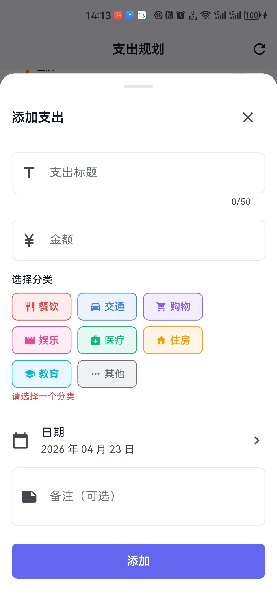
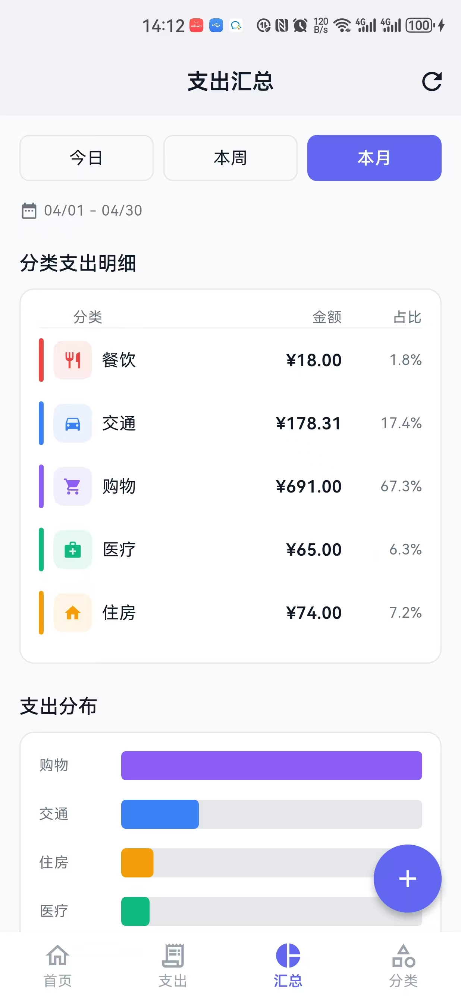

# expense-planner-app

A Flutter expense planning application with local SQLite persistence and Clean Architecture.

## Features

**Home Dashboard**
- Balance overview with total income/expense
- Quick actions: Add Expense, Categories, Monthly Summary
- Recent transactions list

**Expense Management**
- Add, edit, and delete expenses
- Filter by category and date range
- Grouped by date with running totals

**Add / Edit Expense**
- Title, amount, date, note, and category selection
- Icon and color picker for category

**Category Management**
- Create categories with custom icons and colors
- Edit and delete existing categories

**Monthly Summary**
- Pie chart breakdown by category
- Total spending per month
- Expense count per category

<table>
<tr>
<td></td>
<td></td>
<td></td>
<td></td>
</tr>
<tr>
<td colspan="4" align="center"><strong>Home, Expense List & Add Expense</strong></td>
</tr>
<tr>
<td></td>
<td></td>
<td></td>
<td></td>
</tr>
<tr>
<td colspan="4" align="center"><strong>Category Management & Monthly Summary</strong></td>
</tr>
</table>

## Architecture

```
lib/
├── main.dart                    # App entry point
├── core/
│   ├── constants/              # Colors, spacing, strings
│   ├── theme/                   # AppTheme
│   └── utils/                   # Date/currency utilities
├── data/
│   ├── database/               # SQLite helper, table definitions
│   ├── models/                  # Expense, Category, ExpenseSummary
│   └── repositories/           # CRUD operations
├── providers/                   # Riverpod state management
├── screens/                    # Home, Expense, Summary, Category pages
└── widgets/                    # Reusable components
```

- **State Management**: Riverpod
- **Database**: sqflite (SQLite)
- **Architecture**: Clean Architecture

## Getting Started

```bash
# Run the app
flutter run

# Build Android release
flutter build apk --release

# Run tests
flutter test
```

## Tech Stack

- Flutter SDK
- flutter_riverpod ^2.4.9
- sqflite ^2.3.0
- path_provider ^2.1.1
- intl ^0.18.1
- equatable ^2.0.5
